# Furman Basketball Predictions
Matt Smith

``` python
import pandas as pd

furman = pd.read_csv("~/Downloads/Furman Basketball - Final.csv")

furman.head()
furman.tail()
```

<div>
<style scoped>
    .dataframe tbody tr th:only-of-type {
        vertical-align: middle;
    }
&#10;    .dataframe tbody tr th {
        vertical-align: top;
    }
&#10;    .dataframe thead th {
        text-align: right;
    }
</style>

|  | Instance | Date | Location | Opp | Type | Tm | Opp.1 | OT? | FG_Furman | FGA_Furman | ... | FT%\_Opponent | ORB_Opponent | DRB_Opponent | TRB_Opponent | AST_Opponent | STL_Opponent | BLK_Opponent | TOV_Opponent | PF_Opponent | Result |
|----|----|----|----|----|----|----|----|----|----|----|----|----|----|----|----|----|----|----|----|----|----|
| 484 | 485 | 2/26/11 | Home | Wofford | REG (Conf) | 65 | 79 | No | 19 | 41 | ... | 0.579 | 15 | 16 | 31 | 15 | 6 | 0 | 7 | 19 | Lose |
| 485 | 486 | 3/4/11 | Neutral | Samford | CTOURN | 61 | 48 | No | 22 | 48 | ... | 0.750 | 6 | 14 | 20 | 8 | 4 | 0 | 16 | 20 | Win |
| 486 | 487 | 3/5/11 | Away | Chattanooga | CTOURN | 61 | 52 | No | 18 | 42 | ... | 0.517 | 11 | 17 | 28 | 8 | 9 | 2 | 16 | 24 | Win |
| 487 | 488 | 3/6/11 | Neutral | College of Charleston | CTOURN | 58 | 63 | No | 19 | 54 | ... | 0.667 | 13 | 23 | 36 | 7 | 4 | 7 | 7 | 17 | Lose |
| 488 | 489 | 3/15/11 | Away | East Tennessee State | CIT | 63 | 76 | No | 19 | 45 | ... | 0.864 | 7 | 19 | 26 | 9 | 12 | 2 | 11 | 22 | Lose |

<p>5 rows × 51 columns</p>
</div>

``` python
furman.describe(include= 'all')
```

<div>
<style scoped>
    .dataframe tbody tr th:only-of-type {
        vertical-align: middle;
    }
&#10;    .dataframe tbody tr th {
        vertical-align: top;
    }
&#10;    .dataframe thead th {
        text-align: right;
    }
</style>

|  | Instance | Date | Location | Opp | Type | Tm | Opp.1 | OT? | FG_Furman | FGA_Furman | ... | FT%\_Opponent | ORB_Opponent | DRB_Opponent | TRB_Opponent | AST_Opponent | STL_Opponent | BLK_Opponent | TOV_Opponent | PF_Opponent | Result |
|----|----|----|----|----|----|----|----|----|----|----|----|----|----|----|----|----|----|----|----|----|----|
| count | 489.000000 | 489 | 489 | 489 | 489 | 489.000000 | 489.000000 | 489 | 489.000000 | 489.000000 | ... | 489.000000 | 489.000000 | 489.000000 | 489.000000 | 489.000000 | 489.000000 | 489.000000 | 489.000000 | 489.000000 | 489 |
| unique | NaN | 489 | 3 | 110 | 7 | NaN | NaN | 3 | NaN | NaN | ... | NaN | NaN | NaN | NaN | NaN | NaN | NaN | NaN | NaN | 2 |
| top | NaN | 11/4/24 | Away | Samford | REG (Conf) | NaN | NaN | No | NaN | NaN | ... | NaN | NaN | NaN | NaN | NaN | NaN | NaN | NaN | NaN | Win |
| freq | NaN | 1 | 223 | 34 | 265 | NaN | NaN | 461 | NaN | NaN | ... | NaN | NaN | NaN | NaN | NaN | NaN | NaN | NaN | NaN | 287 |
| mean | 245.000000 | NaN | NaN | NaN | NaN | 73.169734 | 68.619632 | NaN | 25.599182 | 56.214724 | ... | 0.695926 | 8.494888 | 22.034765 | 30.529652 | 12.605317 | 6.498978 | 2.907975 | 12.533742 | 17.177914 | NaN |
| std | 141.306405 | NaN | NaN | NaN | NaN | 14.296689 | 11.596641 | NaN | 5.743036 | 7.972603 | ... | 0.131492 | 3.475982 | 4.488695 | 5.499966 | 3.755549 | 2.833584 | 2.082745 | 3.926500 | 4.439373 | NaN |
| min | 1.000000 | NaN | NaN | NaN | NaN | 35.000000 | 35.000000 | NaN | 10.000000 | 37.000000 | ... | 0.200000 | 1.000000 | 11.000000 | 16.000000 | 2.000000 | 0.000000 | 0.000000 | 4.000000 | 6.000000 | NaN |
| 25% | 123.000000 | NaN | NaN | NaN | NaN | 63.000000 | 61.000000 | NaN | 22.000000 | 51.000000 | ... | 0.625000 | 6.000000 | 19.000000 | 27.000000 | 10.000000 | 4.000000 | 1.000000 | 10.000000 | 14.000000 | NaN |
| 50% | 245.000000 | NaN | NaN | NaN | NaN | 73.000000 | 68.000000 | NaN | 25.000000 | 56.000000 | ... | 0.700000 | 8.000000 | 22.000000 | 31.000000 | 12.000000 | 6.000000 | 3.000000 | 12.000000 | 17.000000 | NaN |
| 75% | 367.000000 | NaN | NaN | NaN | NaN | 82.000000 | 76.000000 | NaN | 29.000000 | 61.000000 | ... | 0.786000 | 11.000000 | 25.000000 | 34.000000 | 15.000000 | 8.000000 | 4.000000 | 15.000000 | 20.000000 | NaN |
| max | 489.000000 | NaN | NaN | NaN | NaN | 124.000000 | 117.000000 | NaN | 49.000000 | 85.000000 | ... | 1.000000 | 23.000000 | 37.000000 | 49.000000 | 25.000000 | 17.000000 | 11.000000 | 22.000000 | 34.000000 | NaN |

<p>11 rows × 51 columns</p>
</div>

Research Question

What attributes best predict a Furman Basketball win, and do these
predictors change once the team enters conference play?

To begin the analysis, I created a new binary outcome variable to make
logistic regression possible. Specifically, I encoded game results such
that Win = 1 and Loss = 0. This allows the model to estimate how
different game attributes influence the probability of winning.

``` python
furman['Win_Binary'] = (furman['Result'] == 'Win').astype(int)
furman
```

<div>
<style scoped>
    .dataframe tbody tr th:only-of-type {
        vertical-align: middle;
    }
&#10;    .dataframe tbody tr th {
        vertical-align: top;
    }
&#10;    .dataframe thead th {
        text-align: right;
    }
</style>

|  | Instance | Date | Location | Opp | Type | Tm | Opp.1 | OT? | FG_Furman | FGA_Furman | ... | ORB_Opponent | DRB_Opponent | TRB_Opponent | AST_Opponent | STL_Opponent | BLK_Opponent | TOV_Opponent | PF_Opponent | Result | Win_Binary |
|----|----|----|----|----|----|----|----|----|----|----|----|----|----|----|----|----|----|----|----|----|----|
| 0 | 1 | 11/4/24 | Home | Columbia Intl | REG (Non-Conf) | 104 | 46 | No | 40 | 63 | ... | 7 | 16 | 23 | 7 | 5 | 3 | 17 | 16 | Win | 1 |
| 1 | 2 | 11/8/24 | Away | Belmont | REG (Non-Conf) | 76 | 74 | No | 28 | 59 | ... | 4 | 21 | 25 | 14 | 9 | 1 | 10 | 11 | Win | 1 |
| 2 | 3 | 11/11/24 | Home | Jacksonville | REG (Non-Conf) | 78 | 69 | No | 26 | 57 | ... | 14 | 24 | 38 | 11 | 9 | 7 | 14 | 21 | Win | 1 |
| 3 | 4 | 11/15/24 | Home | Tulane | REG (Non-Conf) | 75 | 67 | No | 22 | 58 | ... | 7 | 26 | 33 | 13 | 4 | 5 | 12 | 19 | Win | 1 |
| 4 | 5 | 11/20/24 | Home | Oglethorpe | REG (Non-Conf) | 124 | 48 | No | 49 | 85 | ... | 1 | 16 | 17 | 8 | 7 | 1 | 14 | 9 | Win | 1 |
| ... | ... | ... | ... | ... | ... | ... | ... | ... | ... | ... | ... | ... | ... | ... | ... | ... | ... | ... | ... | ... | ... |
| 484 | 485 | 2/26/11 | Home | Wofford | REG (Conf) | 65 | 79 | No | 19 | 41 | ... | 15 | 16 | 31 | 15 | 6 | 0 | 7 | 19 | Lose | 0 |
| 485 | 486 | 3/4/11 | Neutral | Samford | CTOURN | 61 | 48 | No | 22 | 48 | ... | 6 | 14 | 20 | 8 | 4 | 0 | 16 | 20 | Win | 1 |
| 486 | 487 | 3/5/11 | Away | Chattanooga | CTOURN | 61 | 52 | No | 18 | 42 | ... | 11 | 17 | 28 | 8 | 9 | 2 | 16 | 24 | Win | 1 |
| 487 | 488 | 3/6/11 | Neutral | College of Charleston | CTOURN | 58 | 63 | No | 19 | 54 | ... | 13 | 23 | 36 | 7 | 4 | 7 | 7 | 17 | Lose | 0 |
| 488 | 489 | 3/15/11 | Away | East Tennessee State | CIT | 63 | 76 | No | 19 | 45 | ... | 7 | 19 | 26 | 9 | 12 | 2 | 11 | 22 | Lose | 0 |

<p>489 rows × 52 columns</p>
</div>

Next, I used logistic regression to identify which variables most
strongly predict the likelihood of a Furman win.

Before fitting the model, I prepared the dataset by selecting and
formatting the numeric variables. This step ensures that only
appropriate predictors are included and that the logistic regression
model runs correctly.

``` python
import re
numeric_furman = furman.select_dtypes(include='number')
numeric_furman.columns = [re.sub('1', 'one', x) for x in numeric_furman.columns]
numeric_furman.columns = [re.sub('2', 'two', x) for x in numeric_furman.columns]
numeric_furman.columns = [re.sub('3', 'three', x) for x in numeric_furman.columns]
numeric_furman.columns = [re.sub('%', 'perc', x) for x in numeric_furman.columns]
numeric_furman.columns = [re.sub('\.', '_', x) for x in numeric_furman.columns]
```

Because many of the original game statistics were highly correlated, I
created “difference” variables for each attribute. For every statistic
reported for both Furman and its opponent, I calculated:

Difference = Furman Stat − Opponent Stat

This transformation preserves the original scale of each metric while
reducing multicollinearity. It also makes the variables more
interpretable in the logistic regression model, since each coefficient
now represents how an advantage in a specific stat increases or
decreases the probability of a Furman win.

``` python
for col in numeric_furman.columns:
    if col.endswith("_Furman"):
        base = col.replace("_Furman", "")
        opp_col = base + "_Opponent"
        
        if opp_col in numeric_furman.columns:
            diff_name = "Diff_" + base
            numeric_furman[diff_name] = numeric_furman[col] - numeric_furman[opp_col]
```

Confirmation that the code above runs correct:

``` python
numeric_furman['FG_Furman'][0]
```

    np.int64(40)

``` python
numeric_furman['FG_Opponent'][0]
```

    np.int64(16)

``` python
numeric_furman['Diff_FG'][0]
```

    np.int64(24)

Next, I generated scatterplots to check for complete or quasi-complete
separation in the data. Separation can occur when a predictor perfectly
distinguishes wins from losses, which can cause instability or failure
in logistic regression estimation. Visualizing each variable against the
win/loss outcome helps identify any predictors that may create this
issue before fitting the model.

``` python
import matplotlib.pyplot as plt

x_vars = [
    'Diff_FTA', 'Diff_ORB', 'Diff_DRB', 'Diff_AST',
    'Diff_STL', 'Diff_BLK', 'Diff_TOV', 'Diff_PF'
]

for var in x_vars:
    plt.figure(figsize=(6,4))
    plt.scatter(numeric_furman[var], numeric_furman['Win_Binary'], alpha=0.6)
    plt.title(f'Win Binary vs {var}')
    plt.xlabel(var)
    plt.ylabel('Win_Binary')
    plt.grid(True, linestyle='--', alpha=0.3)
    plt.show()
```

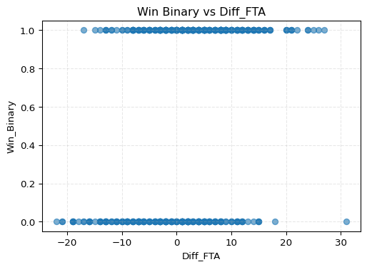

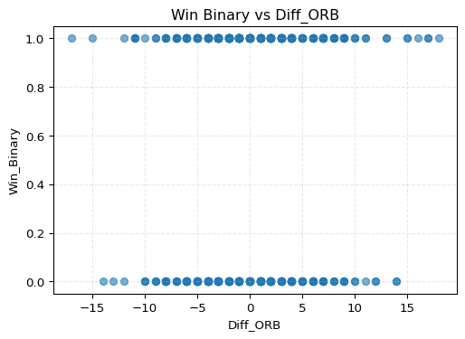

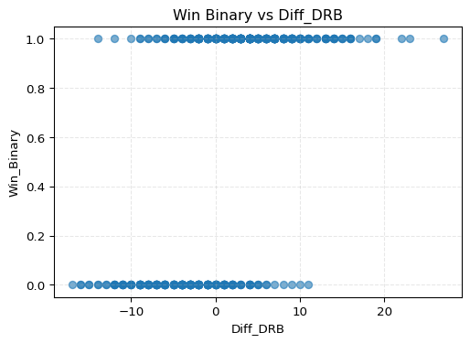

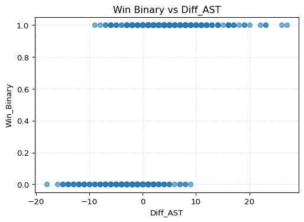

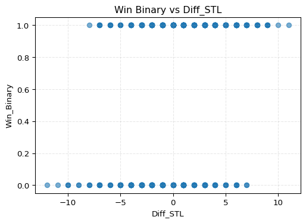

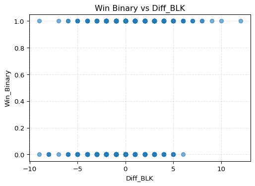

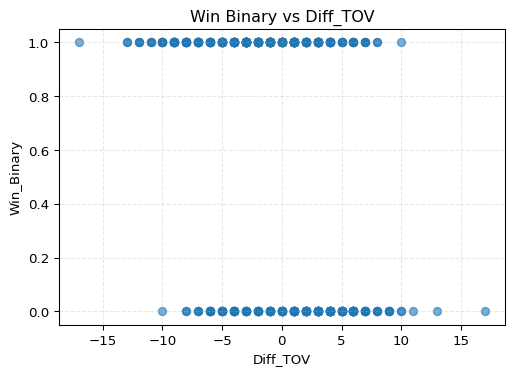

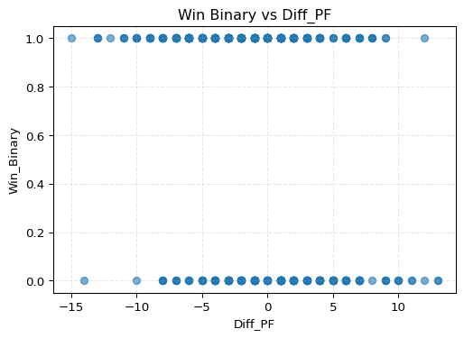

The Diff_AST graph looks to be causing some seperating. I will remove
that as well as others that caused seperation.

``` python
predictors = [col for col in numeric_furman.columns if col.startswith("Diff_")]

remove_cols = [
    'Diff_FGperc', 'Diff_threePperc', 'Diff_twoPperc',
    'Diff_eFGperc', 'Diff_FTperc', 
    'Diff_TRB',
    'Diff_FGA',
    'Diff_threeP',
    'Diff_twoP',
    'Diff_FT',
    'Diff_FG', 
    'Diff_threePA',
    'Diff_twoPA',
    'Diff_AST'
]

predictors = [col for col in predictors if col not in remove_cols]
```

The scatterplot for Diff_AST showed evidence of separation, meaning that
this variable almost perfectly distinguished wins from losses. To avoid
instability in the logistic regression model, I removed Diff_AST along
with any other variables that exhibited similar separation or
multicollinearity issues.

``` python
import statsmodels.formula.api as smf

model1 = smf.logit(
    formula = "Win_Binary ~ " + " + ".join(predictors), #needed AI to figure this one out
    data = numeric_furman
).fit()

model1.summary()
```

    Optimization terminated successfully.
             Current function value: 0.201968
             Iterations 9

Assists and three pointers turned out to be too strong as predictors,
creating separation in the logistic regression model. Because these
statistics almost perfectly distinguish wins from losses, they need to
be removed to ensure the model can be estimated properly. I keep this
observation in the write up to show that certain variables, such as
points scored, are directly tied to the game outcome and should be
excluded from predictive modeling for interpretability and fairness.

After fitting the refined logistic regression model, Diff_FTA, Diff_DRB,
Diff_BLK, and Diff_TOV emerged as statistically significant predictors
of a Furman win. These metrics suggest that getting to the free throw
line, controlling the defensive glass, protecting the rim, and limiting
turnovers all have meaningful effects on game outcomes.

To complement the logistic regression results, I also trained a decision
tree model. The goal of the tree is to identify which single attribute
the model chooses to split on first. This highlights which individual
variable, at a high level, is most predictive of a Furman victory.

Before I can run any models, I want to define my response variable and
set up the predictors. I need to pull out the game result and remove any
columns that should not be included in the model.

``` python
y = furman["Result"] # Set explanatory variables
X = furman.drop(columns=["Result", "Win_Binary", "Tm", "Opp.1"]) # Set response variable
```

Next, I need to think about preprocessing. Since my dataset includes
both numeric and categorical variables, I want a pipeline that handles
each type properly. My plan is to identify the column types, build
specific category mappings, and then apply one hot encoding to the
categorical columns while imputing missing numeric values.

``` python
import numpy as np
from sklearn.compose import ColumnTransformer
from sklearn.preprocessing import OneHotEncoder
from sklearn.pipeline import Pipeline
from sklearn.impute import SimpleImputer

# Identify column types
cat_cols = X.select_dtypes(include=["object", "category"]).columns.tolist()
num_cols = X.select_dtypes(include=[np.number]).columns.tolist()

# Build explicit categories per categorical column
cats_map = {c: sorted(X[c].dropna().unique().tolist()) for c in cat_cols}
cat_cols_eff = [c for c, cats in cats_map.items() if len(cats) > 0]
ohe_categories = [cats_map[c] for c in cat_cols_eff]

# Preprocess: one-hot encode categoricals and impute missing values
preprocess = ColumnTransformer(
    transformers=[
        ("cat",
         OneHotEncoder(
             categories=ohe_categories,
             handle_unknown="ignore",
             sparse_output=False,
             drop=None  # keep both dummies for binary so NaN -> [0,0]
         ),
         cat_cols_eff),
        ("num",
         Pipeline([("imputer", SimpleImputer(strategy="median"))]),
         num_cols),
    ],
    remainder="drop",
)
```

Now that I know how my data will be preprocessed, I want to build the
decision tree classifier. My thinking here is to keep the tree shallow
so I can clearly see the strongest predictive split without the model
overfitting.

``` python
from sklearn.tree import DecisionTreeClassifier, plot_tree

tree_clf = DecisionTreeClassifier(random_state=123,
max_depth=3)
```

At this point, I need to actually transform the dataset using the
preprocessing pipeline. I also need to encode the target variable so the
model can interpret it correctly. Here is how I think about it and then
implement it:

``` python
from sklearn.preprocessing import LabelEncoder
X_trans = preprocess.fit_transform(X)

# Encode target to integers
le = LabelEncoder()
y_enc = le.fit_transform(y)                # e.g., {'no_help':0, 'sought_help':1}
class_names = le.classes_.tolist() 
```

Now that everything is prepared, I can fit the model.

``` python
tree_clf.fit(X_trans, y_enc)
```

<style>#sk-container-id-1 {
  /* Definition of color scheme common for light and dark mode */
  --sklearn-color-text: #000;
  --sklearn-color-text-muted: #666;
  --sklearn-color-line: gray;
  /* Definition of color scheme for unfitted estimators */
  --sklearn-color-unfitted-level-0: #fff5e6;
  --sklearn-color-unfitted-level-1: #f6e4d2;
  --sklearn-color-unfitted-level-2: #ffe0b3;
  --sklearn-color-unfitted-level-3: chocolate;
  /* Definition of color scheme for fitted estimators */
  --sklearn-color-fitted-level-0: #f0f8ff;
  --sklearn-color-fitted-level-1: #d4ebff;
  --sklearn-color-fitted-level-2: #b3dbfd;
  --sklearn-color-fitted-level-3: cornflowerblue;
&#10;  /* Specific color for light theme */
  --sklearn-color-text-on-default-background: var(--sg-text-color, var(--theme-code-foreground, var(--jp-content-font-color1, black)));
  --sklearn-color-background: var(--sg-background-color, var(--theme-background, var(--jp-layout-color0, white)));
  --sklearn-color-border-box: var(--sg-text-color, var(--theme-code-foreground, var(--jp-content-font-color1, black)));
  --sklearn-color-icon: #696969;
&#10;  @media (prefers-color-scheme: dark) {
    /* Redefinition of color scheme for dark theme */
    --sklearn-color-text-on-default-background: var(--sg-text-color, var(--theme-code-foreground, var(--jp-content-font-color1, white)));
    --sklearn-color-background: var(--sg-background-color, var(--theme-background, var(--jp-layout-color0, #111)));
    --sklearn-color-border-box: var(--sg-text-color, var(--theme-code-foreground, var(--jp-content-font-color1, white)));
    --sklearn-color-icon: #878787;
  }
}
&#10;#sk-container-id-1 {
  color: var(--sklearn-color-text);
}
&#10;#sk-container-id-1 pre {
  padding: 0;
}
&#10;#sk-container-id-1 input.sk-hidden--visually {
  border: 0;
  clip: rect(1px 1px 1px 1px);
  clip: rect(1px, 1px, 1px, 1px);
  height: 1px;
  margin: -1px;
  overflow: hidden;
  padding: 0;
  position: absolute;
  width: 1px;
}
&#10;#sk-container-id-1 div.sk-dashed-wrapped {
  border: 1px dashed var(--sklearn-color-line);
  margin: 0 0.4em 0.5em 0.4em;
  box-sizing: border-box;
  padding-bottom: 0.4em;
  background-color: var(--sklearn-color-background);
}
&#10;#sk-container-id-1 div.sk-container {
  /* jupyter's `normalize.less` sets `[hidden] { display: none; }`
     but bootstrap.min.css set `[hidden] { display: none !important; }`
     so we also need the `!important` here to be able to override the
     default hidden behavior on the sphinx rendered scikit-learn.org.
     See: https://github.com/scikit-learn/scikit-learn/issues/21755 */
  display: inline-block !important;
  position: relative;
}
&#10;#sk-container-id-1 div.sk-text-repr-fallback {
  display: none;
}
&#10;div.sk-parallel-item,
div.sk-serial,
div.sk-item {
  /* draw centered vertical line to link estimators */
  background-image: linear-gradient(var(--sklearn-color-text-on-default-background), var(--sklearn-color-text-on-default-background));
  background-size: 2px 100%;
  background-repeat: no-repeat;
  background-position: center center;
}
&#10;/* Parallel-specific style estimator block */
&#10;#sk-container-id-1 div.sk-parallel-item::after {
  content: "";
  width: 100%;
  border-bottom: 2px solid var(--sklearn-color-text-on-default-background);
  flex-grow: 1;
}
&#10;#sk-container-id-1 div.sk-parallel {
  display: flex;
  align-items: stretch;
  justify-content: center;
  background-color: var(--sklearn-color-background);
  position: relative;
}
&#10;#sk-container-id-1 div.sk-parallel-item {
  display: flex;
  flex-direction: column;
}
&#10;#sk-container-id-1 div.sk-parallel-item:first-child::after {
  align-self: flex-end;
  width: 50%;
}
&#10;#sk-container-id-1 div.sk-parallel-item:last-child::after {
  align-self: flex-start;
  width: 50%;
}
&#10;#sk-container-id-1 div.sk-parallel-item:only-child::after {
  width: 0;
}
&#10;/* Serial-specific style estimator block */
&#10;#sk-container-id-1 div.sk-serial {
  display: flex;
  flex-direction: column;
  align-items: center;
  background-color: var(--sklearn-color-background);
  padding-right: 1em;
  padding-left: 1em;
}
&#10;
/* Toggleable style: style used for estimator/Pipeline/ColumnTransformer box that is
clickable and can be expanded/collapsed.
- Pipeline and ColumnTransformer use this feature and define the default style
- Estimators will overwrite some part of the style using the `sk-estimator` class
*/
&#10;/* Pipeline and ColumnTransformer style (default) */
&#10;#sk-container-id-1 div.sk-toggleable {
  /* Default theme specific background. It is overwritten whether we have a
  specific estimator or a Pipeline/ColumnTransformer */
  background-color: var(--sklearn-color-background);
}
&#10;/* Toggleable label */
#sk-container-id-1 label.sk-toggleable__label {
  cursor: pointer;
  display: flex;
  width: 100%;
  margin-bottom: 0;
  padding: 0.5em;
  box-sizing: border-box;
  text-align: center;
  align-items: start;
  justify-content: space-between;
  gap: 0.5em;
}
&#10;#sk-container-id-1 label.sk-toggleable__label .caption {
  font-size: 0.6rem;
  font-weight: lighter;
  color: var(--sklearn-color-text-muted);
}
&#10;#sk-container-id-1 label.sk-toggleable__label-arrow:before {
  /* Arrow on the left of the label */
  content: "▸";
  float: left;
  margin-right: 0.25em;
  color: var(--sklearn-color-icon);
}
&#10;#sk-container-id-1 label.sk-toggleable__label-arrow:hover:before {
  color: var(--sklearn-color-text);
}
&#10;/* Toggleable content - dropdown */
&#10;#sk-container-id-1 div.sk-toggleable__content {
  display: none;
  text-align: left;
  /* unfitted */
  background-color: var(--sklearn-color-unfitted-level-0);
}
&#10;#sk-container-id-1 div.sk-toggleable__content.fitted {
  /* fitted */
  background-color: var(--sklearn-color-fitted-level-0);
}
&#10;#sk-container-id-1 div.sk-toggleable__content pre {
  margin: 0.2em;
  border-radius: 0.25em;
  color: var(--sklearn-color-text);
  /* unfitted */
  background-color: var(--sklearn-color-unfitted-level-0);
}
&#10;#sk-container-id-1 div.sk-toggleable__content.fitted pre {
  /* unfitted */
  background-color: var(--sklearn-color-fitted-level-0);
}
&#10;#sk-container-id-1 input.sk-toggleable__control:checked~div.sk-toggleable__content {
  /* Expand drop-down */
  display: block;
  width: 100%;
  overflow: visible;
}
&#10;#sk-container-id-1 input.sk-toggleable__control:checked~label.sk-toggleable__label-arrow:before {
  content: "▾";
}
&#10;/* Pipeline/ColumnTransformer-specific style */
&#10;#sk-container-id-1 div.sk-label input.sk-toggleable__control:checked~label.sk-toggleable__label {
  color: var(--sklearn-color-text);
  background-color: var(--sklearn-color-unfitted-level-2);
}
&#10;#sk-container-id-1 div.sk-label.fitted input.sk-toggleable__control:checked~label.sk-toggleable__label {
  background-color: var(--sklearn-color-fitted-level-2);
}
&#10;/* Estimator-specific style */
&#10;/* Colorize estimator box */
#sk-container-id-1 div.sk-estimator input.sk-toggleable__control:checked~label.sk-toggleable__label {
  /* unfitted */
  background-color: var(--sklearn-color-unfitted-level-2);
}
&#10;#sk-container-id-1 div.sk-estimator.fitted input.sk-toggleable__control:checked~label.sk-toggleable__label {
  /* fitted */
  background-color: var(--sklearn-color-fitted-level-2);
}
&#10;#sk-container-id-1 div.sk-label label.sk-toggleable__label,
#sk-container-id-1 div.sk-label label {
  /* The background is the default theme color */
  color: var(--sklearn-color-text-on-default-background);
}
&#10;/* On hover, darken the color of the background */
#sk-container-id-1 div.sk-label:hover label.sk-toggleable__label {
  color: var(--sklearn-color-text);
  background-color: var(--sklearn-color-unfitted-level-2);
}
&#10;/* Label box, darken color on hover, fitted */
#sk-container-id-1 div.sk-label.fitted:hover label.sk-toggleable__label.fitted {
  color: var(--sklearn-color-text);
  background-color: var(--sklearn-color-fitted-level-2);
}
&#10;/* Estimator label */
&#10;#sk-container-id-1 div.sk-label label {
  font-family: monospace;
  font-weight: bold;
  display: inline-block;
  line-height: 1.2em;
}
&#10;#sk-container-id-1 div.sk-label-container {
  text-align: center;
}
&#10;/* Estimator-specific */
#sk-container-id-1 div.sk-estimator {
  font-family: monospace;
  border: 1px dotted var(--sklearn-color-border-box);
  border-radius: 0.25em;
  box-sizing: border-box;
  margin-bottom: 0.5em;
  /* unfitted */
  background-color: var(--sklearn-color-unfitted-level-0);
}
&#10;#sk-container-id-1 div.sk-estimator.fitted {
  /* fitted */
  background-color: var(--sklearn-color-fitted-level-0);
}
&#10;/* on hover */
#sk-container-id-1 div.sk-estimator:hover {
  /* unfitted */
  background-color: var(--sklearn-color-unfitted-level-2);
}
&#10;#sk-container-id-1 div.sk-estimator.fitted:hover {
  /* fitted */
  background-color: var(--sklearn-color-fitted-level-2);
}
&#10;/* Specification for estimator info (e.g. "i" and "?") */
&#10;/* Common style for "i" and "?" */
&#10;.sk-estimator-doc-link,
a:link.sk-estimator-doc-link,
a:visited.sk-estimator-doc-link {
  float: right;
  font-size: smaller;
  line-height: 1em;
  font-family: monospace;
  background-color: var(--sklearn-color-background);
  border-radius: 1em;
  height: 1em;
  width: 1em;
  text-decoration: none !important;
  margin-left: 0.5em;
  text-align: center;
  /* unfitted */
  border: var(--sklearn-color-unfitted-level-1) 1pt solid;
  color: var(--sklearn-color-unfitted-level-1);
}
&#10;.sk-estimator-doc-link.fitted,
a:link.sk-estimator-doc-link.fitted,
a:visited.sk-estimator-doc-link.fitted {
  /* fitted */
  border: var(--sklearn-color-fitted-level-1) 1pt solid;
  color: var(--sklearn-color-fitted-level-1);
}
&#10;/* On hover */
div.sk-estimator:hover .sk-estimator-doc-link:hover,
.sk-estimator-doc-link:hover,
div.sk-label-container:hover .sk-estimator-doc-link:hover,
.sk-estimator-doc-link:hover {
  /* unfitted */
  background-color: var(--sklearn-color-unfitted-level-3);
  color: var(--sklearn-color-background);
  text-decoration: none;
}
&#10;div.sk-estimator.fitted:hover .sk-estimator-doc-link.fitted:hover,
.sk-estimator-doc-link.fitted:hover,
div.sk-label-container:hover .sk-estimator-doc-link.fitted:hover,
.sk-estimator-doc-link.fitted:hover {
  /* fitted */
  background-color: var(--sklearn-color-fitted-level-3);
  color: var(--sklearn-color-background);
  text-decoration: none;
}
&#10;/* Span, style for the box shown on hovering the info icon */
.sk-estimator-doc-link span {
  display: none;
  z-index: 9999;
  position: relative;
  font-weight: normal;
  right: .2ex;
  padding: .5ex;
  margin: .5ex;
  width: min-content;
  min-width: 20ex;
  max-width: 50ex;
  color: var(--sklearn-color-text);
  box-shadow: 2pt 2pt 4pt #999;
  /* unfitted */
  background: var(--sklearn-color-unfitted-level-0);
  border: .5pt solid var(--sklearn-color-unfitted-level-3);
}
&#10;.sk-estimator-doc-link.fitted span {
  /* fitted */
  background: var(--sklearn-color-fitted-level-0);
  border: var(--sklearn-color-fitted-level-3);
}
&#10;.sk-estimator-doc-link:hover span {
  display: block;
}
&#10;/* "?"-specific style due to the `<a>` HTML tag */
&#10;#sk-container-id-1 a.estimator_doc_link {
  float: right;
  font-size: 1rem;
  line-height: 1em;
  font-family: monospace;
  background-color: var(--sklearn-color-background);
  border-radius: 1rem;
  height: 1rem;
  width: 1rem;
  text-decoration: none;
  /* unfitted */
  color: var(--sklearn-color-unfitted-level-1);
  border: var(--sklearn-color-unfitted-level-1) 1pt solid;
}
&#10;#sk-container-id-1 a.estimator_doc_link.fitted {
  /* fitted */
  border: var(--sklearn-color-fitted-level-1) 1pt solid;
  color: var(--sklearn-color-fitted-level-1);
}
&#10;/* On hover */
#sk-container-id-1 a.estimator_doc_link:hover {
  /* unfitted */
  background-color: var(--sklearn-color-unfitted-level-3);
  color: var(--sklearn-color-background);
  text-decoration: none;
}
&#10;#sk-container-id-1 a.estimator_doc_link.fitted:hover {
  /* fitted */
  background-color: var(--sklearn-color-fitted-level-3);
}
&#10;.estimator-table summary {
    padding: .5rem;
    font-family: monospace;
    cursor: pointer;
}
&#10;.estimator-table details[open] {
    padding-left: 0.1rem;
    padding-right: 0.1rem;
    padding-bottom: 0.3rem;
}
&#10;.estimator-table .parameters-table {
    margin-left: auto !important;
    margin-right: auto !important;
}
&#10;.estimator-table .parameters-table tr:nth-child(odd) {
    background-color: #fff;
}
&#10;.estimator-table .parameters-table tr:nth-child(even) {
    background-color: #f6f6f6;
}
&#10;.estimator-table .parameters-table tr:hover {
    background-color: #e0e0e0;
}
&#10;.estimator-table table td {
    border: 1px solid rgba(106, 105, 104, 0.232);
}
&#10;.user-set td {
    color:rgb(255, 94, 0);
    text-align: left;
}
&#10;.user-set td.value pre {
    color:rgb(255, 94, 0) !important;
    background-color: transparent !important;
}
&#10;.default td {
    color: black;
    text-align: left;
}
&#10;.user-set td i,
.default td i {
    color: black;
}
&#10;.copy-paste-icon {
    background-image: url(data:image/svg+xml;base64,PHN2ZyB4bWxucz0iaHR0cDovL3d3dy53My5vcmcvMjAwMC9zdmciIHZpZXdCb3g9IjAgMCA0NDggNTEyIj48IS0tIUZvbnQgQXdlc29tZSBGcmVlIDYuNy4yIGJ5IEBmb250YXdlc29tZSAtIGh0dHBzOi8vZm9udGF3ZXNvbWUuY29tIExpY2Vuc2UgLSBodHRwczovL2ZvbnRhd2Vzb21lLmNvbS9saWNlbnNlL2ZyZWUgQ29weXJpZ2h0IDIwMjUgRm9udGljb25zLCBJbmMuLS0+PHBhdGggZD0iTTIwOCAwTDMzMi4xIDBjMTIuNyAwIDI0LjkgNS4xIDMzLjkgMTQuMWw2Ny45IDY3LjljOSA5IDE0LjEgMjEuMiAxNC4xIDMzLjlMNDQ4IDMzNmMwIDI2LjUtMjEuNSA0OC00OCA0OGwtMTkyIDBjLTI2LjUgMC00OC0yMS41LTQ4LTQ4bDAtMjg4YzAtMjYuNSAyMS41LTQ4IDQ4LTQ4ek00OCAxMjhsODAgMCAwIDY0LTY0IDAgMCAyNTYgMTkyIDAgMC0zMiA2NCAwIDAgNDhjMCAyNi41LTIxLjUgNDgtNDggNDhMNDggNTEyYy0yNi41IDAtNDgtMjEuNS00OC00OEwwIDE3NmMwLTI2LjUgMjEuNS00OCA0OC00OHoiLz48L3N2Zz4=);
    background-repeat: no-repeat;
    background-size: 14px 14px;
    background-position: 0;
    display: inline-block;
    width: 14px;
    height: 14px;
    cursor: pointer;
}
</style><body><div id="sk-container-id-1" class="sk-top-container"><div class="sk-text-repr-fallback"><pre>DecisionTreeClassifier(max_depth=3, random_state=123)</pre><b>In a Jupyter environment, please rerun this cell to show the HTML representation or trust the notebook. <br />On GitHub, the HTML representation is unable to render, please try loading this page with nbviewer.org.</b></div><div class="sk-container" hidden><div class="sk-item"><div class="sk-estimator fitted sk-toggleable"><input class="sk-toggleable__control sk-hidden--visually" id="sk-estimator-id-1" type="checkbox" checked><label for="sk-estimator-id-1" class="sk-toggleable__label fitted sk-toggleable__label-arrow"><div><div>DecisionTreeClassifier</div></div><div><a class="sk-estimator-doc-link fitted" rel="noreferrer" target="_blank" href="https://scikit-learn.org/1.7/modules/generated/sklearn.tree.DecisionTreeClassifier.html">?<span>Documentation for DecisionTreeClassifier</span></a><span class="sk-estimator-doc-link fitted">i<span>Fitted</span></span></div></label><div class="sk-toggleable__content fitted" data-param-prefix="">
        <div class="estimator-table">
            <details>
                <summary>Parameters</summary>
                &#10;

|     |                           |        |
|-----|---------------------------|--------|
|     | criterion                 | 'gini' |
|     | splitter                  | 'best' |
|     | max_depth                 | 3      |
|     | min_samples_split         | 2      |
|     | min_samples_leaf          | 1      |
|     | min_weight_fraction_leaf  | 0.0    |
|     | max_features              | None   |
|     | random_state              | 123    |
|     | max_leaf_nodes            | None   |
|     | min_impurity_decrease     | 0.0    |
|     | class_weight              | None   |
|     | ccp_alpha                 | 0.0    |
|     | monotonic_cst             | None   |

            </details>
        </div>
    </div></div></div></div></div><script>function copyToClipboard(text, element) {
    // Get the parameter prefix from the closest toggleable content
    const toggleableContent = element.closest('.sk-toggleable__content');
    const paramPrefix = toggleableContent ? toggleableContent.dataset.paramPrefix : '';
    const fullParamName = paramPrefix ? `${paramPrefix}${text}` : text;
&#10;    const originalStyle = element.style;
    const computedStyle = window.getComputedStyle(element);
    const originalWidth = computedStyle.width;
    const originalHTML = element.innerHTML.replace('Copied!', '');
&#10;    navigator.clipboard.writeText(fullParamName)
        .then(() => {
            element.style.width = originalWidth;
            element.style.color = 'green';
            element.innerHTML = "Copied!";
&#10;            setTimeout(() => {
                element.innerHTML = originalHTML;
                element.style = originalStyle;
            }, 2000);
        })
        .catch(err => {
            console.error('Failed to copy:', err);
            element.style.color = 'red';
            element.innerHTML = "Failed!";
            setTimeout(() => {
                element.innerHTML = originalHTML;
                element.style = originalStyle;
            }, 2000);
        });
    return false;
}
&#10;document.querySelectorAll('.fa-regular.fa-copy').forEach(function(element) {
    const toggleableContent = element.closest('.sk-toggleable__content');
    const paramPrefix = toggleableContent ? toggleableContent.dataset.paramPrefix : '';
    const paramName = element.parentElement.nextElementSibling.textContent.trim();
    const fullParamName = paramPrefix ? `${paramPrefix}${paramName}` : paramName;
&#10;    element.setAttribute('title', fullParamName);
});
</script></body>

``` python
import dtreeviz
viz_model = dtreeviz.model(
    tree_clf,
    X_train=X_trans,
    y_train=y_enc,
    feature_names=preprocess.get_feature_names_out(),
    target_name="Result",
    class_names=class_names  # keep stable order
)

v = viz_model.view(fontname="DejaVu Sans")
v
```

    Ignoring fixed x limits to fulfill fixed data aspect with adjustable data limits.
    Ignoring fixed x limits to fulfill fixed data aspect with adjustable data limits.
    Ignoring fixed x limits to fulfill fixed data aspect with adjustable data limits.
    Ignoring fixed x limits to fulfill fixed data aspect with adjustable data limits.
    Ignoring fixed x limits to fulfill fixed data aspect with adjustable data limits.
    Ignoring fixed x limits to fulfill fixed data aspect with adjustable data limits.
    Ignoring fixed x limits to fulfill fixed data aspect with adjustable data limits.
    Ignoring fixed x limits to fulfill fixed data aspect with adjustable data limits.

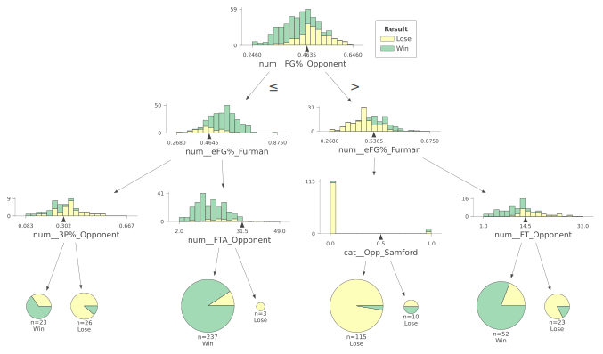

When I look at the decision tree, shooting percentages clearly stand out
as the strongest indicators of a Furman win. The model chooses opponent
field goal percentage as the very first split, which tells me that
limiting how well the other team shoots is the most important high-level
factor in predicting success.

# SoCon

While looking at all the data together is helpful, I need to recognize
the reality of mid-major basketball. It is extremely rare to reach the
NCAA Tournament without winning the conference title. Because Furman
plays in the SoCon, the non-conference schedule functions more as a
testing ground to learn about the team’s strengths and weaknesses. What
truly matters for Furman’s postseason hopes is the SoCon regular season
and, especially, the conference tournament.

Teams in the SoCon also scout each other during the non-conference slate
and will tailor their game plans once they have film on you. Because of
that, it can even be advantageous to keep some of your best offensive
and defensive sets hidden until conference play begins. If this is the
case, the most important variables for predicting wins may differ
between non-conference and conference games. This is exactly why I want
to separate the two and analyze whether the key predictors change once
Furman enters SoCon play.

``` python
socon = furman[furman['Type'].isin(['REG (Conf)', 'CTOURN'])]
socon
```

<div>
<style scoped>
    .dataframe tbody tr th:only-of-type {
        vertical-align: middle;
    }
&#10;    .dataframe tbody tr th {
        vertical-align: top;
    }
&#10;    .dataframe thead th {
        text-align: right;
    }
</style>

|  | Instance | Date | Location | Opp | Type | Tm | Opp.1 | OT? | FG_Furman | FGA_Furman | ... | ORB_Opponent | DRB_Opponent | TRB_Opponent | AST_Opponent | STL_Opponent | BLK_Opponent | TOV_Opponent | PF_Opponent | Result | Win_Binary |
|----|----|----|----|----|----|----|----|----|----|----|----|----|----|----|----|----|----|----|----|----|----|
| 13 | 14 | 1/1/25 | Away | Western Carolina | REG (Conf) | 90 | 61 | No | 29 | 64 | ... | 8 | 28 | 36 | 9 | 3 | 6 | 13 | 20 | Win | 1 |
| 14 | 15 | 1/4/25 | Away | UNC Greensboro | REG (Conf) | 67 | 84 | No | 22 | 56 | ... | 8 | 21 | 29 | 12 | 9 | 2 | 9 | 14 | Lose | 0 |
| 15 | 16 | 1/8/25 | Away | The Citadel | REG (Conf) | 67 | 63 | OT | 22 | 60 | ... | 10 | 24 | 34 | 10 | 9 | 4 | 18 | 15 | Win | 1 |
| 16 | 17 | 1/13/25 | Home | Wofford | REG (Conf) | 62 | 81 | No | 23 | 69 | ... | 19 | 30 | 49 | 15 | 4 | 4 | 10 | 18 | Lose | 0 |
| 17 | 18 | 1/15/25 | Home | East Tennessee State | REG (Conf) | 73 | 70 | No | 24 | 54 | ... | 13 | 21 | 34 | 5 | 8 | 3 | 12 | 21 | Win | 1 |
| ... | ... | ... | ... | ... | ... | ... | ... | ... | ... | ... | ... | ... | ... | ... | ... | ... | ... | ... | ... | ... | ... |
| 483 | 484 | 2/21/11 | Away | Chattanooga | REG (Conf) | 59 | 75 | No | 22 | 57 | ... | 7 | 31 | 38 | 13 | 6 | 2 | 12 | 17 | Lose | 0 |
| 484 | 485 | 2/26/11 | Home | Wofford | REG (Conf) | 65 | 79 | No | 19 | 41 | ... | 15 | 16 | 31 | 15 | 6 | 0 | 7 | 19 | Lose | 0 |
| 485 | 486 | 3/4/11 | Neutral | Samford | CTOURN | 61 | 48 | No | 22 | 48 | ... | 6 | 14 | 20 | 8 | 4 | 0 | 16 | 20 | Win | 1 |
| 486 | 487 | 3/5/11 | Away | Chattanooga | CTOURN | 61 | 52 | No | 18 | 42 | ... | 11 | 17 | 28 | 8 | 9 | 2 | 16 | 24 | Win | 1 |
| 487 | 488 | 3/6/11 | Neutral | College of Charleston | CTOURN | 58 | 63 | No | 19 | 54 | ... | 13 | 23 | 36 | 7 | 4 | 7 | 7 | 17 | Lose | 0 |

<p>294 rows × 52 columns</p>
</div>

I am now going to rerun both the logistic regression and the decision
tree, but this time I will focus only on SoCon games. My goal is to see
whether the most important predictors of a Furman win change once
conference play starts. I will use the same logic and code structure
that I used above, just applied to the SoCon subset of the data.

``` python
import re
numeric_socon = socon.select_dtypes(include='number')
numeric_socon.columns = [re.sub('1', 'one', x) for x in numeric_socon.columns]
numeric_socon.columns = [re.sub('2', 'two', x) for x in numeric_socon.columns]
numeric_socon.columns = [re.sub('3', 'three', x) for x in numeric_socon.columns]
numeric_socon.columns = [re.sub('%', 'perc', x) for x in numeric_socon.columns]
numeric_socon.columns = [re.sub('\.', '_', x) for x in numeric_socon.columns]
```

``` python
for col in numeric_socon.columns:
    if col.endswith("_Furman"):
        base = col.replace("_Furman", "")
        opp_col = base + "_Opponent"
        
        if opp_col in numeric_socon.columns:
            diff_name = "Diff_" + base
            numeric_socon[diff_name] = numeric_socon[col] - numeric_socon[opp_col]
```

Confirmation that code above works:

``` python
numeric_socon['FG_Furman'][13]
```

    np.int64(29)

``` python
numeric_socon['FG_Opponent'][13]
```

    np.int64(19)

``` python
numeric_socon['Diff_FG'][13]
```

    np.int64(10)

Now recheck for seperation:

``` python
import matplotlib.pyplot as plt

x_vars = [
    'Diff_FTA', 'Diff_ORB', 'Diff_DRB', 'Diff_AST',
    'Diff_STL', 'Diff_BLK', 'Diff_TOV', 'Diff_PF'
]

for var in x_vars:
    plt.figure(figsize=(6,4))
    plt.scatter(numeric_socon[var], numeric_socon['Win_Binary'], alpha=0.6)
    plt.title(f'Win Binary vs {var}')
    plt.xlabel(var)
    plt.ylabel('Win_Binary')
    plt.grid(True, linestyle='--', alpha=0.3)
    plt.show()
```

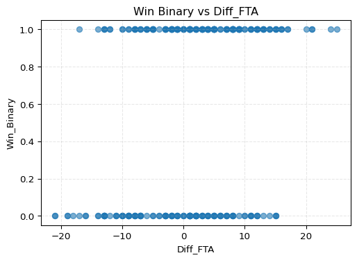

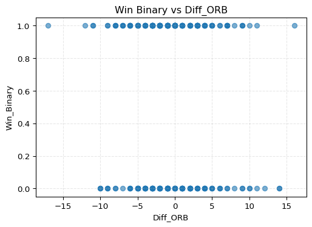

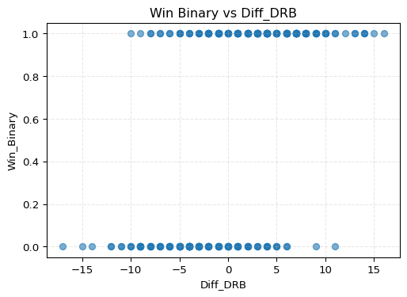

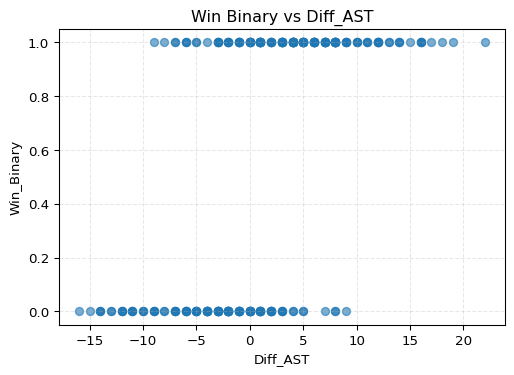

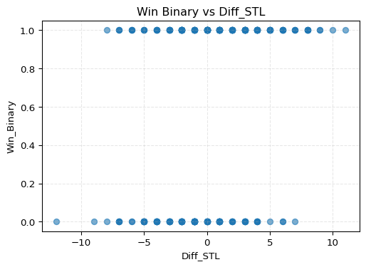

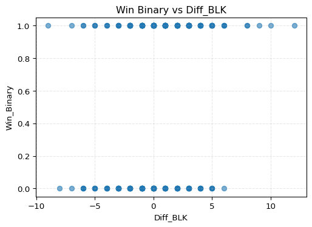

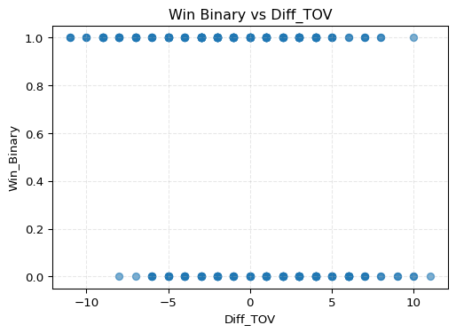

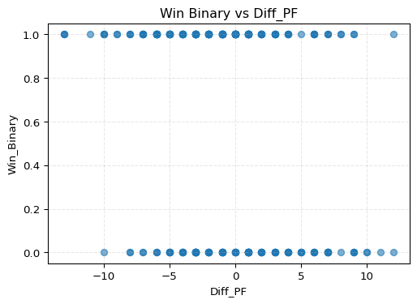

Diff_AST again looks like it needs to be removed.

Now run logistic regression:

``` python
predictors = [col for col in numeric_socon.columns if col.startswith("Diff_")]

remove_cols = [
    'Diff_FGperc', 'Diff_threePperc', 'Diff_twoPperc',
    'Diff_eFGperc', 'Diff_FTperc', 
    'Diff_TRB',
    'Diff_FGA',
    'Diff_threeP',
    'Diff_twoP',
    'Diff_FT',
    'Diff_FG', 
    'Diff_threePA',
    'Diff_twoPA',
    'Diff_AST'
]

predictors = [col for col in predictors if col not in remove_cols]
```

``` python
model2 = smf.logit(
    formula = "Win_Binary ~ " + " + ".join(predictors), #needed AI to figure this one out
    data = numeric_socon
).fit()

model2.summary()
```

    Optimization terminated successfully.
             Current function value: 0.202821
             Iterations 8

From the logistic regression on only SoCon games, the statistically
significant variables are Diff_FTA, Diff_DRB, and Diff_TOV. These
results tell me that getting to the free throw line, controlling the
defensive boards, and limiting turnovers continue to play an important
role within conference play. Assists and three pointers again were too
predictive for this.

Now I want to run the decision tree on the SoCon subset to see what
single variable it chooses as the top splitter. This will help me
understand which attribute is the most important high-level indicator of
a Furman win specifically during conference games.

``` python
y = socon["Result"] # Set explanatory variables
X = socon.drop(columns=["Result", "Win_Binary", "Tm", "Opp.1"]) # Set response
```

``` python
import numpy as np
from sklearn.compose import ColumnTransformer
from sklearn.preprocessing import OneHotEncoder
from sklearn.pipeline import Pipeline
from sklearn.impute import SimpleImputer

# Identify column types
cat_cols = X.select_dtypes(include=["object", "category"]).columns.tolist()
num_cols = X.select_dtypes(include=[np.number]).columns.tolist()

# Build explicit categories per categorical column
cats_map = {c: sorted(X[c].dropna().unique().tolist()) for c in cat_cols}
cat_cols_eff = [c for c, cats in cats_map.items() if len(cats) > 0]
ohe_categories = [cats_map[c] for c in cat_cols_eff]

# Preprocess: one-hot encode categoricals and impute missing values
preprocess = ColumnTransformer(
    transformers=[
        ("cat",
         OneHotEncoder(
             categories=ohe_categories,
             handle_unknown="ignore",
             sparse_output=False,
             drop=None  # keep both dummies for binary so NaN -> [0,0]
         ),
         cat_cols_eff),
        ("num",
         Pipeline([("imputer", SimpleImputer(strategy="median"))]),
         num_cols),
    ],
    remainder="drop",
)
```

``` python
from sklearn.tree import DecisionTreeClassifier, plot_tree

tree_clf = DecisionTreeClassifier(random_state=123,
max_depth=3)
```

``` python
from sklearn.preprocessing import LabelEncoder
X_trans = preprocess.fit_transform(X)

# Encode target to integers
le = LabelEncoder()
y_enc = le.fit_transform(y)                # e.g., {'no_help':0, 'sought_help':1}
class_names = le.classes_.tolist() 
```

``` python
tree_clf.fit(X_trans, y_enc)
```

<style>#sk-container-id-2 {
  /* Definition of color scheme common for light and dark mode */
  --sklearn-color-text: #000;
  --sklearn-color-text-muted: #666;
  --sklearn-color-line: gray;
  /* Definition of color scheme for unfitted estimators */
  --sklearn-color-unfitted-level-0: #fff5e6;
  --sklearn-color-unfitted-level-1: #f6e4d2;
  --sklearn-color-unfitted-level-2: #ffe0b3;
  --sklearn-color-unfitted-level-3: chocolate;
  /* Definition of color scheme for fitted estimators */
  --sklearn-color-fitted-level-0: #f0f8ff;
  --sklearn-color-fitted-level-1: #d4ebff;
  --sklearn-color-fitted-level-2: #b3dbfd;
  --sklearn-color-fitted-level-3: cornflowerblue;
&#10;  /* Specific color for light theme */
  --sklearn-color-text-on-default-background: var(--sg-text-color, var(--theme-code-foreground, var(--jp-content-font-color1, black)));
  --sklearn-color-background: var(--sg-background-color, var(--theme-background, var(--jp-layout-color0, white)));
  --sklearn-color-border-box: var(--sg-text-color, var(--theme-code-foreground, var(--jp-content-font-color1, black)));
  --sklearn-color-icon: #696969;
&#10;  @media (prefers-color-scheme: dark) {
    /* Redefinition of color scheme for dark theme */
    --sklearn-color-text-on-default-background: var(--sg-text-color, var(--theme-code-foreground, var(--jp-content-font-color1, white)));
    --sklearn-color-background: var(--sg-background-color, var(--theme-background, var(--jp-layout-color0, #111)));
    --sklearn-color-border-box: var(--sg-text-color, var(--theme-code-foreground, var(--jp-content-font-color1, white)));
    --sklearn-color-icon: #878787;
  }
}
&#10;#sk-container-id-2 {
  color: var(--sklearn-color-text);
}
&#10;#sk-container-id-2 pre {
  padding: 0;
}
&#10;#sk-container-id-2 input.sk-hidden--visually {
  border: 0;
  clip: rect(1px 1px 1px 1px);
  clip: rect(1px, 1px, 1px, 1px);
  height: 1px;
  margin: -1px;
  overflow: hidden;
  padding: 0;
  position: absolute;
  width: 1px;
}
&#10;#sk-container-id-2 div.sk-dashed-wrapped {
  border: 1px dashed var(--sklearn-color-line);
  margin: 0 0.4em 0.5em 0.4em;
  box-sizing: border-box;
  padding-bottom: 0.4em;
  background-color: var(--sklearn-color-background);
}
&#10;#sk-container-id-2 div.sk-container {
  /* jupyter's `normalize.less` sets `[hidden] { display: none; }`
     but bootstrap.min.css set `[hidden] { display: none !important; }`
     so we also need the `!important` here to be able to override the
     default hidden behavior on the sphinx rendered scikit-learn.org.
     See: https://github.com/scikit-learn/scikit-learn/issues/21755 */
  display: inline-block !important;
  position: relative;
}
&#10;#sk-container-id-2 div.sk-text-repr-fallback {
  display: none;
}
&#10;div.sk-parallel-item,
div.sk-serial,
div.sk-item {
  /* draw centered vertical line to link estimators */
  background-image: linear-gradient(var(--sklearn-color-text-on-default-background), var(--sklearn-color-text-on-default-background));
  background-size: 2px 100%;
  background-repeat: no-repeat;
  background-position: center center;
}
&#10;/* Parallel-specific style estimator block */
&#10;#sk-container-id-2 div.sk-parallel-item::after {
  content: "";
  width: 100%;
  border-bottom: 2px solid var(--sklearn-color-text-on-default-background);
  flex-grow: 1;
}
&#10;#sk-container-id-2 div.sk-parallel {
  display: flex;
  align-items: stretch;
  justify-content: center;
  background-color: var(--sklearn-color-background);
  position: relative;
}
&#10;#sk-container-id-2 div.sk-parallel-item {
  display: flex;
  flex-direction: column;
}
&#10;#sk-container-id-2 div.sk-parallel-item:first-child::after {
  align-self: flex-end;
  width: 50%;
}
&#10;#sk-container-id-2 div.sk-parallel-item:last-child::after {
  align-self: flex-start;
  width: 50%;
}
&#10;#sk-container-id-2 div.sk-parallel-item:only-child::after {
  width: 0;
}
&#10;/* Serial-specific style estimator block */
&#10;#sk-container-id-2 div.sk-serial {
  display: flex;
  flex-direction: column;
  align-items: center;
  background-color: var(--sklearn-color-background);
  padding-right: 1em;
  padding-left: 1em;
}
&#10;
/* Toggleable style: style used for estimator/Pipeline/ColumnTransformer box that is
clickable and can be expanded/collapsed.
- Pipeline and ColumnTransformer use this feature and define the default style
- Estimators will overwrite some part of the style using the `sk-estimator` class
*/
&#10;/* Pipeline and ColumnTransformer style (default) */
&#10;#sk-container-id-2 div.sk-toggleable {
  /* Default theme specific background. It is overwritten whether we have a
  specific estimator or a Pipeline/ColumnTransformer */
  background-color: var(--sklearn-color-background);
}
&#10;/* Toggleable label */
#sk-container-id-2 label.sk-toggleable__label {
  cursor: pointer;
  display: flex;
  width: 100%;
  margin-bottom: 0;
  padding: 0.5em;
  box-sizing: border-box;
  text-align: center;
  align-items: start;
  justify-content: space-between;
  gap: 0.5em;
}
&#10;#sk-container-id-2 label.sk-toggleable__label .caption {
  font-size: 0.6rem;
  font-weight: lighter;
  color: var(--sklearn-color-text-muted);
}
&#10;#sk-container-id-2 label.sk-toggleable__label-arrow:before {
  /* Arrow on the left of the label */
  content: "▸";
  float: left;
  margin-right: 0.25em;
  color: var(--sklearn-color-icon);
}
&#10;#sk-container-id-2 label.sk-toggleable__label-arrow:hover:before {
  color: var(--sklearn-color-text);
}
&#10;/* Toggleable content - dropdown */
&#10;#sk-container-id-2 div.sk-toggleable__content {
  display: none;
  text-align: left;
  /* unfitted */
  background-color: var(--sklearn-color-unfitted-level-0);
}
&#10;#sk-container-id-2 div.sk-toggleable__content.fitted {
  /* fitted */
  background-color: var(--sklearn-color-fitted-level-0);
}
&#10;#sk-container-id-2 div.sk-toggleable__content pre {
  margin: 0.2em;
  border-radius: 0.25em;
  color: var(--sklearn-color-text);
  /* unfitted */
  background-color: var(--sklearn-color-unfitted-level-0);
}
&#10;#sk-container-id-2 div.sk-toggleable__content.fitted pre {
  /* unfitted */
  background-color: var(--sklearn-color-fitted-level-0);
}
&#10;#sk-container-id-2 input.sk-toggleable__control:checked~div.sk-toggleable__content {
  /* Expand drop-down */
  display: block;
  width: 100%;
  overflow: visible;
}
&#10;#sk-container-id-2 input.sk-toggleable__control:checked~label.sk-toggleable__label-arrow:before {
  content: "▾";
}
&#10;/* Pipeline/ColumnTransformer-specific style */
&#10;#sk-container-id-2 div.sk-label input.sk-toggleable__control:checked~label.sk-toggleable__label {
  color: var(--sklearn-color-text);
  background-color: var(--sklearn-color-unfitted-level-2);
}
&#10;#sk-container-id-2 div.sk-label.fitted input.sk-toggleable__control:checked~label.sk-toggleable__label {
  background-color: var(--sklearn-color-fitted-level-2);
}
&#10;/* Estimator-specific style */
&#10;/* Colorize estimator box */
#sk-container-id-2 div.sk-estimator input.sk-toggleable__control:checked~label.sk-toggleable__label {
  /* unfitted */
  background-color: var(--sklearn-color-unfitted-level-2);
}
&#10;#sk-container-id-2 div.sk-estimator.fitted input.sk-toggleable__control:checked~label.sk-toggleable__label {
  /* fitted */
  background-color: var(--sklearn-color-fitted-level-2);
}
&#10;#sk-container-id-2 div.sk-label label.sk-toggleable__label,
#sk-container-id-2 div.sk-label label {
  /* The background is the default theme color */
  color: var(--sklearn-color-text-on-default-background);
}
&#10;/* On hover, darken the color of the background */
#sk-container-id-2 div.sk-label:hover label.sk-toggleable__label {
  color: var(--sklearn-color-text);
  background-color: var(--sklearn-color-unfitted-level-2);
}
&#10;/* Label box, darken color on hover, fitted */
#sk-container-id-2 div.sk-label.fitted:hover label.sk-toggleable__label.fitted {
  color: var(--sklearn-color-text);
  background-color: var(--sklearn-color-fitted-level-2);
}
&#10;/* Estimator label */
&#10;#sk-container-id-2 div.sk-label label {
  font-family: monospace;
  font-weight: bold;
  display: inline-block;
  line-height: 1.2em;
}
&#10;#sk-container-id-2 div.sk-label-container {
  text-align: center;
}
&#10;/* Estimator-specific */
#sk-container-id-2 div.sk-estimator {
  font-family: monospace;
  border: 1px dotted var(--sklearn-color-border-box);
  border-radius: 0.25em;
  box-sizing: border-box;
  margin-bottom: 0.5em;
  /* unfitted */
  background-color: var(--sklearn-color-unfitted-level-0);
}
&#10;#sk-container-id-2 div.sk-estimator.fitted {
  /* fitted */
  background-color: var(--sklearn-color-fitted-level-0);
}
&#10;/* on hover */
#sk-container-id-2 div.sk-estimator:hover {
  /* unfitted */
  background-color: var(--sklearn-color-unfitted-level-2);
}
&#10;#sk-container-id-2 div.sk-estimator.fitted:hover {
  /* fitted */
  background-color: var(--sklearn-color-fitted-level-2);
}
&#10;/* Specification for estimator info (e.g. "i" and "?") */
&#10;/* Common style for "i" and "?" */
&#10;.sk-estimator-doc-link,
a:link.sk-estimator-doc-link,
a:visited.sk-estimator-doc-link {
  float: right;
  font-size: smaller;
  line-height: 1em;
  font-family: monospace;
  background-color: var(--sklearn-color-background);
  border-radius: 1em;
  height: 1em;
  width: 1em;
  text-decoration: none !important;
  margin-left: 0.5em;
  text-align: center;
  /* unfitted */
  border: var(--sklearn-color-unfitted-level-1) 1pt solid;
  color: var(--sklearn-color-unfitted-level-1);
}
&#10;.sk-estimator-doc-link.fitted,
a:link.sk-estimator-doc-link.fitted,
a:visited.sk-estimator-doc-link.fitted {
  /* fitted */
  border: var(--sklearn-color-fitted-level-1) 1pt solid;
  color: var(--sklearn-color-fitted-level-1);
}
&#10;/* On hover */
div.sk-estimator:hover .sk-estimator-doc-link:hover,
.sk-estimator-doc-link:hover,
div.sk-label-container:hover .sk-estimator-doc-link:hover,
.sk-estimator-doc-link:hover {
  /* unfitted */
  background-color: var(--sklearn-color-unfitted-level-3);
  color: var(--sklearn-color-background);
  text-decoration: none;
}
&#10;div.sk-estimator.fitted:hover .sk-estimator-doc-link.fitted:hover,
.sk-estimator-doc-link.fitted:hover,
div.sk-label-container:hover .sk-estimator-doc-link.fitted:hover,
.sk-estimator-doc-link.fitted:hover {
  /* fitted */
  background-color: var(--sklearn-color-fitted-level-3);
  color: var(--sklearn-color-background);
  text-decoration: none;
}
&#10;/* Span, style for the box shown on hovering the info icon */
.sk-estimator-doc-link span {
  display: none;
  z-index: 9999;
  position: relative;
  font-weight: normal;
  right: .2ex;
  padding: .5ex;
  margin: .5ex;
  width: min-content;
  min-width: 20ex;
  max-width: 50ex;
  color: var(--sklearn-color-text);
  box-shadow: 2pt 2pt 4pt #999;
  /* unfitted */
  background: var(--sklearn-color-unfitted-level-0);
  border: .5pt solid var(--sklearn-color-unfitted-level-3);
}
&#10;.sk-estimator-doc-link.fitted span {
  /* fitted */
  background: var(--sklearn-color-fitted-level-0);
  border: var(--sklearn-color-fitted-level-3);
}
&#10;.sk-estimator-doc-link:hover span {
  display: block;
}
&#10;/* "?"-specific style due to the `<a>` HTML tag */
&#10;#sk-container-id-2 a.estimator_doc_link {
  float: right;
  font-size: 1rem;
  line-height: 1em;
  font-family: monospace;
  background-color: var(--sklearn-color-background);
  border-radius: 1rem;
  height: 1rem;
  width: 1rem;
  text-decoration: none;
  /* unfitted */
  color: var(--sklearn-color-unfitted-level-1);
  border: var(--sklearn-color-unfitted-level-1) 1pt solid;
}
&#10;#sk-container-id-2 a.estimator_doc_link.fitted {
  /* fitted */
  border: var(--sklearn-color-fitted-level-1) 1pt solid;
  color: var(--sklearn-color-fitted-level-1);
}
&#10;/* On hover */
#sk-container-id-2 a.estimator_doc_link:hover {
  /* unfitted */
  background-color: var(--sklearn-color-unfitted-level-3);
  color: var(--sklearn-color-background);
  text-decoration: none;
}
&#10;#sk-container-id-2 a.estimator_doc_link.fitted:hover {
  /* fitted */
  background-color: var(--sklearn-color-fitted-level-3);
}
&#10;.estimator-table summary {
    padding: .5rem;
    font-family: monospace;
    cursor: pointer;
}
&#10;.estimator-table details[open] {
    padding-left: 0.1rem;
    padding-right: 0.1rem;
    padding-bottom: 0.3rem;
}
&#10;.estimator-table .parameters-table {
    margin-left: auto !important;
    margin-right: auto !important;
}
&#10;.estimator-table .parameters-table tr:nth-child(odd) {
    background-color: #fff;
}
&#10;.estimator-table .parameters-table tr:nth-child(even) {
    background-color: #f6f6f6;
}
&#10;.estimator-table .parameters-table tr:hover {
    background-color: #e0e0e0;
}
&#10;.estimator-table table td {
    border: 1px solid rgba(106, 105, 104, 0.232);
}
&#10;.user-set td {
    color:rgb(255, 94, 0);
    text-align: left;
}
&#10;.user-set td.value pre {
    color:rgb(255, 94, 0) !important;
    background-color: transparent !important;
}
&#10;.default td {
    color: black;
    text-align: left;
}
&#10;.user-set td i,
.default td i {
    color: black;
}
&#10;.copy-paste-icon {
    background-image: url(data:image/svg+xml;base64,PHN2ZyB4bWxucz0iaHR0cDovL3d3dy53My5vcmcvMjAwMC9zdmciIHZpZXdCb3g9IjAgMCA0NDggNTEyIj48IS0tIUZvbnQgQXdlc29tZSBGcmVlIDYuNy4yIGJ5IEBmb250YXdlc29tZSAtIGh0dHBzOi8vZm9udGF3ZXNvbWUuY29tIExpY2Vuc2UgLSBodHRwczovL2ZvbnRhd2Vzb21lLmNvbS9saWNlbnNlL2ZyZWUgQ29weXJpZ2h0IDIwMjUgRm9udGljb25zLCBJbmMuLS0+PHBhdGggZD0iTTIwOCAwTDMzMi4xIDBjMTIuNyAwIDI0LjkgNS4xIDMzLjkgMTQuMWw2Ny45IDY3LjljOSA5IDE0LjEgMjEuMiAxNC4xIDMzLjlMNDQ4IDMzNmMwIDI2LjUtMjEuNSA0OC00OCA0OGwtMTkyIDBjLTI2LjUgMC00OC0yMS41LTQ4LTQ4bDAtMjg4YzAtMjYuNSAyMS41LTQ4IDQ4LTQ4ek00OCAxMjhsODAgMCAwIDY0LTY0IDAgMCAyNTYgMTkyIDAgMC0zMiA2NCAwIDAgNDhjMCAyNi41LTIxLjUgNDgtNDggNDhMNDggNTEyYy0yNi41IDAtNDgtMjEuNS00OC00OEwwIDE3NmMwLTI2LjUgMjEuNS00OCA0OC00OHoiLz48L3N2Zz4=);
    background-repeat: no-repeat;
    background-size: 14px 14px;
    background-position: 0;
    display: inline-block;
    width: 14px;
    height: 14px;
    cursor: pointer;
}
</style><body><div id="sk-container-id-2" class="sk-top-container"><div class="sk-text-repr-fallback"><pre>DecisionTreeClassifier(max_depth=3, random_state=123)</pre><b>In a Jupyter environment, please rerun this cell to show the HTML representation or trust the notebook. <br />On GitHub, the HTML representation is unable to render, please try loading this page with nbviewer.org.</b></div><div class="sk-container" hidden><div class="sk-item"><div class="sk-estimator fitted sk-toggleable"><input class="sk-toggleable__control sk-hidden--visually" id="sk-estimator-id-2" type="checkbox" checked><label for="sk-estimator-id-2" class="sk-toggleable__label fitted sk-toggleable__label-arrow"><div><div>DecisionTreeClassifier</div></div><div><a class="sk-estimator-doc-link fitted" rel="noreferrer" target="_blank" href="https://scikit-learn.org/1.7/modules/generated/sklearn.tree.DecisionTreeClassifier.html">?<span>Documentation for DecisionTreeClassifier</span></a><span class="sk-estimator-doc-link fitted">i<span>Fitted</span></span></div></label><div class="sk-toggleable__content fitted" data-param-prefix="">
        <div class="estimator-table">
            <details>
                <summary>Parameters</summary>
                &#10;

|     |                           |        |
|-----|---------------------------|--------|
|     | criterion                 | 'gini' |
|     | splitter                  | 'best' |
|     | max_depth                 | 3      |
|     | min_samples_split         | 2      |
|     | min_samples_leaf          | 1      |
|     | min_weight_fraction_leaf  | 0.0    |
|     | max_features              | None   |
|     | random_state              | 123    |
|     | max_leaf_nodes            | None   |
|     | min_impurity_decrease     | 0.0    |
|     | class_weight              | None   |
|     | ccp_alpha                 | 0.0    |
|     | monotonic_cst             | None   |

            </details>
        </div>
    </div></div></div></div></div><script>function copyToClipboard(text, element) {
    // Get the parameter prefix from the closest toggleable content
    const toggleableContent = element.closest('.sk-toggleable__content');
    const paramPrefix = toggleableContent ? toggleableContent.dataset.paramPrefix : '';
    const fullParamName = paramPrefix ? `${paramPrefix}${text}` : text;
&#10;    const originalStyle = element.style;
    const computedStyle = window.getComputedStyle(element);
    const originalWidth = computedStyle.width;
    const originalHTML = element.innerHTML.replace('Copied!', '');
&#10;    navigator.clipboard.writeText(fullParamName)
        .then(() => {
            element.style.width = originalWidth;
            element.style.color = 'green';
            element.innerHTML = "Copied!";
&#10;            setTimeout(() => {
                element.innerHTML = originalHTML;
                element.style = originalStyle;
            }, 2000);
        })
        .catch(err => {
            console.error('Failed to copy:', err);
            element.style.color = 'red';
            element.innerHTML = "Failed!";
            setTimeout(() => {
                element.innerHTML = originalHTML;
                element.style = originalStyle;
            }, 2000);
        });
    return false;
}
&#10;document.querySelectorAll('.fa-regular.fa-copy').forEach(function(element) {
    const toggleableContent = element.closest('.sk-toggleable__content');
    const paramPrefix = toggleableContent ? toggleableContent.dataset.paramPrefix : '';
    const paramName = element.parentElement.nextElementSibling.textContent.trim();
    const fullParamName = paramPrefix ? `${paramPrefix}${paramName}` : paramName;
&#10;    element.setAttribute('title', fullParamName);
});
</script></body>

``` python
import dtreeviz
viz_model = dtreeviz.model(
    tree_clf,
    X_train=X_trans,
    y_train=y_enc,
    feature_names=preprocess.get_feature_names_out(),
    target_name="Result",
    class_names=class_names  # keep stable order
)

v = viz_model.view(fontname="DejaVu Sans")
v
```

    Ignoring fixed x limits to fulfill fixed data aspect with adjustable data limits.
    Ignoring fixed x limits to fulfill fixed data aspect with adjustable data limits.
    Ignoring fixed x limits to fulfill fixed data aspect with adjustable data limits.
    Ignoring fixed x limits to fulfill fixed data aspect with adjustable data limits.
    Ignoring fixed x limits to fulfill fixed data aspect with adjustable data limits.
    Ignoring fixed x limits to fulfill fixed data aspect with adjustable data limits.
    Ignoring fixed x limits to fulfill fixed data aspect with adjustable data limits.
    Ignoring fixed x limits to fulfill fixed data aspect with adjustable data limits.

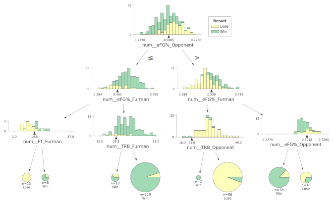

From the decision tree on SoCon games, a high eFG% comes out as the most
important variable. This makes sense, because eFG% accounts for the
added value of three pointers and reflects the overall efficiency of
both two and three point shooting. Given that the SoCon is known as a
high-octane, three-point-heavy league, it is logical that shooting
efficiency would play an even larger role in predicting wins during
conference play.

When I analyzed the full season data, several variables stood out as
meaningful predictors of a Furman win. After removing statistics that
caused separation in the logistic regression model, such as assists and
three-point makes, I found that Diff_FTA, Diff_DRB, Diff_BLK, and
Diff_TOV were statistically significant. These results suggest that
winning the free throw battle, controlling the defensive glass,
protecting the rim, and taking care of the ball are all important
indicators of success. The decision tree reinforced the importance of
shooting efficiency, as opponent field goal percentage emerged as the
top splitter when looking at all games. This shows that limiting the
opponent’s shooting success is the single strongest high-level factor in
predicting a Furman victory across the full season.

However, when I narrowed the analysis to conference play, some patterns
shifted. Within SoCon games, Diff_FTA, Diff_DRB, and Diff_TOV remained
significant in the logistic regression, showing that these fundamentals
still matter once the games become more important. But the decision tree
revealed a different top predictor: effective field goal percentage.
This makes sense given the SoCon’s reputation as a three-point-heavy,
high-pace league, where shooting efficiency has an even greater impact
on game outcomes. Overall, the analysis shows that while fundamentals
like rebounding, free throws, and ball security are consistently
important, the value of shooting efficiency becomes especially prominent
once Furman enters conference play.
